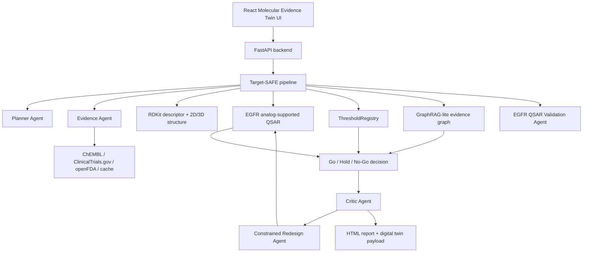

# Target-SAFE Molecular Evidence Digital Twin Implementation Guide

## 1. 해결하려는 문제

The original concept was a broad autonomous lead-optimization agent. That was aligned with the competition theme, but it had a serious evaluation risk: it could look like another "LLM + RDKit + ChEMBL + report" demo and could overclaim generated molecules without enough experimental evidence.

Target-SAFE reframes the contribution as **evidence-gated lead triage**. It does not claim to invent a drug. It helps a researcher inspect seed-derived EGFR candidates and decide whether each one should be advanced, held for more evidence, or rejected.

## 2. 기존안의 문제점과 변경 방향

Before:

- Molecules were ranked by fixed weighted scores.
- QSAR-like activity was heuristic and not sufficiently explainable.
- UI was mostly a Streamlit table, useful but not memorable for judging.
- GPU/API usage was implicit rather than user-selectable.
- Evidence existed, but it was not represented as a decision graph.

After:

- Fixed weights are replaced by sourced threshold gates and conservative interval checks.
- Every threshold is recorded in `outputs/threshold_registry.json`.
- Each candidate has a molecular evidence twin: structure, descriptors, activity interval, applicability domain, analogs, evidence, decision, and next validation.
- Evidence is represented as a GraphRAG-lite decision graph in `outputs/evidence_graph.json`.
- Critic findings now trigger a constrained redesign iteration and parent/child comparison.
- EGFR QSAR validation now writes explicit validation outputs or `insufficient_data` when rows are not enough.
- Evidence mode is surfaced as offline fallback, live, cached, mixed, or error fallback.
- Compute profiles make CPU/GPU/API tradeoffs explicit.
- React provides the main judging interface; Streamlit remains as fallback.

## 3. 최종 시스템 개요

Target-SAFE is a full-stack molecular triage platform for the EGFR mutation-positive NSCLC pilot.

Main capabilities:

- Generate seed-derived analog candidates.
- Compute RDKit/fallback descriptors and molecular depictions.
- Estimate EGFR activity with analog-supported QSAR and prediction intervals.
- Track applicability domain and nearest known analogs.
- Apply sourced Go/Hold/No-Go gates.
- Build a candidate-centered evidence graph.
- Render a React molecular digital twin UI.
- Export model card, threshold registry, evidence graph, ablation report, HTML report, and JSON results.

## 4. 아키텍처



Key modules:

- `targetsafe/api.py`: FastAPI entrypoint.
- `targetsafe/pipeline.py`: end-to-end orchestration.
- `targetsafe/compute_profiles.py`: CPU/GPU/API execution profiles.
- `targetsafe/thresholds.py`: sourced threshold registry.
- `targetsafe/qsar.py`: analog-supported EGFR QSAR, interval, applicability domain, model card.
- `targetsafe/evidence_graph.py`: GraphRAG-lite evidence graph and molecular twin payload.
- `targetsafe/chem.py`: descriptors, 2D depiction, optional computed conformer.
- `targetsafe/redesign.py`: critic-triggered constrained redesign and parent/child comparison.
- `targetsafe/validation.py`: EGFR QSAR validation metrics or explicit insufficient-data report.
- `frontend/`: Vite + React + TypeScript judging UI.

## 5. 프로그램 파이프라인

1. User selects disease, target, seed SMILES, candidate count, and compute profile.
2. Planner Agent creates a cautious run plan.
3. Evidence Agent retrieves ChEMBL, ClinicalTrials.gov, and openFDA evidence or uses fallback data.
4. Candidate generator creates seed-derived analogs and controls.
5. RDKit evaluator validates SMILES, computes descriptors, creates 2D SVG, and optionally creates a computed conformer.
6. QSAR module estimates pChEMBL mean/lower/upper interval, applicability domain, and nearest analogs.
7. Optional GPU profile adds GPU detection and analog retrieval metadata, falling back safely if unavailable.
8. Decision module applies threshold-sourced hard gates and uncertainty-aware triage.
9. Critic Agent downgrades unsupported Go calls and records cautionary findings.
10. Redesign Agent converts eligible critic findings into constrained EGFR reference/template child candidates.
11. Child candidates are re-evaluated with the same descriptor, QSAR, threshold, and critic logic.
12. Validation Agent runs EGFR QSAR validation when enough rows exist or reports `insufficient_data`.
13. Evidence graph connects candidate, descriptor, prediction, analog, threshold, alert, risk, redesign, and decision nodes.
14. React UI renders the candidate board, molecular twin, conformer view, evidence graph, model card, validation, redesign report, and trace.
15. Reports and JSON artifacts are written under `outputs/`.

## 6. Go/Hold/No-Go 의사결정 로직

`Go` requires:

- valid SMILES,
- no severe structural blocker,
- descriptor gates pass,
- conservative pChEMBL lower bound passes the activity floor,
- candidate is inside the applicability domain,
- prediction interval is not too broad,
- evidence support is sufficient,
- Critic Agent has no blocking finding.

`Hold` is the default for uncertainty:

- evidence is incomplete,
- public API fallback was used,
- QSAR is out-of-domain,
- prediction interval is wide,
- non-severe alerts need review,
- evidence graph contains mixed support and review edges.

`No-Go` is reserved for hard blockers:

- invalid SMILES,
- severe structural alert,
- extreme descriptor failure,
- very low QED,
- very high synthetic accessibility risk,
- unsupported confident activity claim outside the model domain.

The numeric values are not hidden in code-only constants. They are exported with provenance in `outputs/threshold_registry.json`.

## 7. 외부 API, LLM API, GPU 비의존 전략

Compute profiles:

- `CPU demo`: no network, no GPU, deterministic fallback data.
- `CPU evidence-grade`: live public APIs with CPU RDKit/scikit-learn-ready QSAR path.
- `GPU accelerated`: optional GPU detection, analog retrieval metadata, and future ensemble hook.
- `API assisted`: optional LLM summary and hosted service support.
- `Full research mode`: live evidence, optional GPU, optional LLM graph-grounded report support.

GPU is optional. If GPU is requested but unavailable, the system returns a clear fallback status instead of crashing. The core demo remains CPU-safe.

LLM is optional. It can improve planning and report language, but final decisions remain tool-grounded and graph-backed.

## 8. 결과물 형식

Primary UI:

- React dashboard at `frontend/`.
- Streamlit fallback through `streamlit run app.py`.

Generated outputs:

- `outputs/model_card_egfr.json`
- `outputs/threshold_registry.json`
- `outputs/evidence_graph.json`
- `outputs/ablation_report.html`
- `outputs/evaluation_metrics_egfr.json`
- `outputs/qsar_validation_report.html`
- `outputs/scaffold_split_summary.json`
- `outputs/*_targetsafe_report.html`
- `outputs/*_result.json`

The React UI shows:

- candidate board,
- 2D molecular structure,
- computed conformer view,
- prediction interval,
- applicability domain,
- nearest analogs,
- ADMET/risk rails,
- evidence graph,
- agent trace,
- evidence mode,
- QSAR validation status and metrics,
- critic redesign parent/child comparison,
- model card,
- HTML report link.

## 9. 테스트 및 평가 시나리오

Run backend tests:

```powershell
python -m unittest discover -s tests
```

Run API:

```powershell
uvicorn targetsafe.api:app --reload
```

Run frontend:

```powershell
cd frontend
npm install
npm run dev
```

Build frontend:

```powershell
cd frontend
npm run build
```

Implemented tests check:

- offline pipeline run,
- invalid SMILES -> No-Go,
- alert-heavy candidate -> Hold or No-Go,
- every decision has threshold IDs,
- every decision has evidence graph nodes,
- GPU profile falls back without crashing.
- critic-triggered redesign children keep parent IDs.
- invalid SMILES is not redesigned as if it were a valid molecule.
- offline fallback validation reports insufficient data instead of fake metrics.
- synthetic/live-like EGFR rows generate validation metrics.

## 10. 한계와 후속 고도화

Current limitations:

- Offline QSAR is analog-supported and demo-grade unless validation rows are sufficient.
- If scikit-learn is unavailable, validation uses a deterministic nearest-analog baseline and labels it as a fallback.
- Computed conformer is not a binding pose.
- Clinical/regulatory evidence is class-level context, not candidate-specific safety evidence.
- Hosted ADMET and true GPU deep-learning ensemble are optional future upgrades.

Recommended next upgrades:

- Increase live ChEMBL EGFR rows for stronger scaffold-split validation.
- Add SHAP/permutation or nearest-neighbor explanation for model output.
- Add hosted ADMET adapters with provenance.
- Add visual ablation comparison in the React UI.
- Add PDF export for final report.

Target-SAFE's defensible contribution is not novelty by molecule generation. Its contribution is a reproducible, explainable, evidence-gated narrowing workflow for early lead triage.
