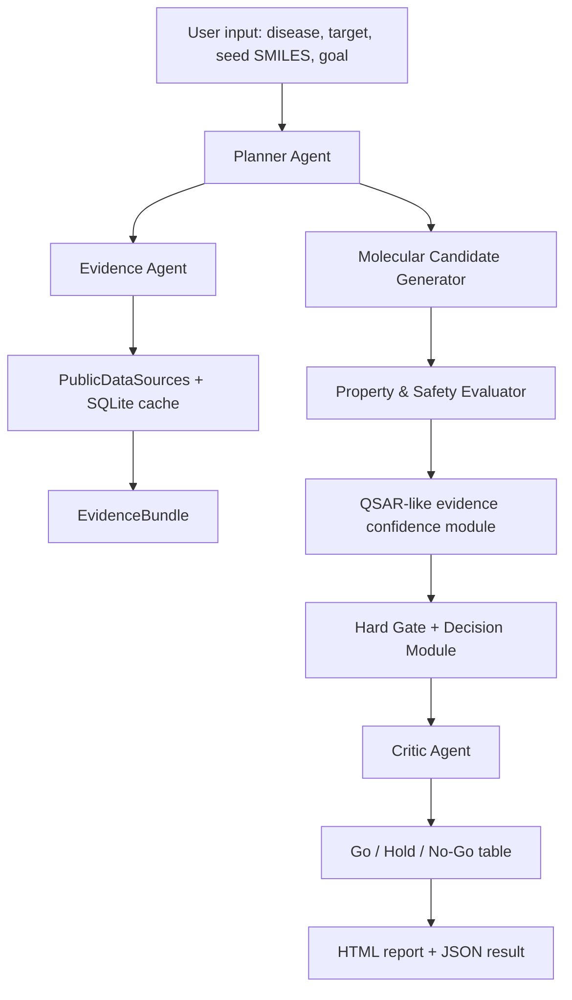

# Target-SAFE Lead Agent Implementation Guide

## 1. Problem Recognized

The original idea was a broad multi-agent molecule generation system. It was
well aligned with the hackathon theme, but it had three serious risks:

- It could look like a familiar combination of LLM agents, RDKit, ChEMBL,
  PubChem, ADMET filters, and a report generator.
- It could overclaim candidate-level clinical or regulatory meaning even
  though new virtual candidates do not have direct clinical evidence.
- It could rank molecules by a single weighted score even when a candidate has
  invalid structure, toxic alerts, weak evidence, or poor applicability-domain
  support.

Target-SAFE reframes the project from "AI invents molecules" to
"AI narrows early lead-review scope with transparent evidence-gated triage."
This is the practical contribution: it helps researchers reject, hold, or
prioritize candidates with traceable reasons instead of producing unsupported
drug-discovery claims.

## 2. Competition-Based Contribution

The 4th JUMP AI Agentic Drug Challenge rewards problem definition, agentic
planning, tool use, scientific validity, implementation feasibility, and
transparent demonstration. Target-SAFE contributes to those criteria as follows:

- It defines a narrow, realistic drug-discovery problem: early EGFR lead
  triage for EGFR-mutant NSCLC.
- It uses agents for planning, evidence collection, criticism, and reporting
  rather than only chat-style explanation.
- It grounds decisions in deterministic tools and public evidence instead of
  LLM-only reasoning.
- It treats clinical and regulatory evidence as class-level risk context, not
  as candidate-specific proof.
- It exposes uncertainty and downgrades weak candidates to Hold or No-Go.
- It runs without local GPU and without optional dependencies, while still
  benefiting from RDKit, Streamlit, and LLM APIs when they are available.

## 3. Final System Overview

Target-SAFE is an Evidence-Gated Lead Triage Agent. Given disease, target,
seed SMILES, and an optimization goal, it generates seed-derived candidates and
classifies each one as `Go`, `Hold`, or `No-Go`.

The current MVP is focused on EGFR-mutant NSCLC. It is designed so the target
can be extended later, but the first implementation intentionally avoids a
wide unfocused scope.

Primary outputs:

- candidate table
- descriptor and risk table
- Go/Hold/No-Go decision table
- tool-call logs
- critic findings
- HTML report
- JSON result
- packaged program bundle

## 4. Architecture



Important modules:

- `app.py`: Streamlit entrypoint. If Streamlit is unavailable, it runs a CLI
  demo.
- `targetsafe/pipeline.py`: end-to-end orchestration.
- `targetsafe/agents.py`: Planner, Evidence, Critic, Report agents and an
  optional OpenAI-compatible LLM client.
- `targetsafe/chem.py`: candidate generation, descriptor calculation, optional
  RDKit path, and deterministic heuristic fallback.
- `targetsafe/data_sources.py`: ChEMBL, ClinicalTrials.gov, openFDA clients
  with fallback evidence and SQLite cache.
- `targetsafe/qsar.py`: reference-scaffold similarity, predicted activity,
  evidence confidence, and applicability-domain scoring.
- `targetsafe/decision.py`: hard gates, weighted score, and final decision.
- `targetsafe/report.py`: HTML report generation.
- `targetsafe/cache.py`: SQLite cache for public API responses.

## 5. Program Pipeline

1. The user enters disease, target, seed SMILES, and optimization goal.
2. Planner Agent creates a cautious execution plan.
3. Evidence Agent collects public evidence from ChEMBL, ClinicalTrials.gov,
   and openFDA.
4. If network access fails or is disabled, fallback evidence is used and logged.
5. The candidate generator creates at least 50 seed-derived analog candidates.
6. The evaluator calculates validity, MW, LogP, TPSA, HBD, HBA, rotatable
   bonds, QED, Lipinski violations, alerts, and SA score.
7. RDKit is used when installed. Otherwise, deterministic heuristics are used.
8. The QSAR-like module estimates predicted activity, evidence confidence, and
   applicability-domain support.
9. The Decision Module applies hard gates before any weighted ranking.
10. Critic Agent checks invalid structures, severe alerts, weak evidence,
    out-of-domain candidates, and heuristic-only descriptors.
11. Each candidate is classified as `Go`, `Hold`, or `No-Go`.
12. The pipeline writes an HTML report and JSON result under `outputs/`.

## 6. Go/Hold/No-Go Decision Logic

The decision process is intentionally conservative.

Hard gates are checked first:

- invalid SMILES
- severe structural alert
- extreme molecular weight
- extreme LogP or TPSA
- low QED
- poor synthetic accessibility

If a candidate fails a hard gate, it becomes `No-Go` regardless of total score.

For candidates that pass hard gates, the total score is calculated as:

```text
Total Score =
0.30 * predicted activity
+ 0.25 * drug-likeness
+ 0.20 * toxicity safety
+ 0.15 * synthetic accessibility
+ 0.10 * evidence confidence
```

`Go` requires hard-gate pass, acceptable evidence confidence, applicability
domain support, and no structural alerts. `Hold` means plausible but requiring
additional evidence or expert review. `No-Go` means invalid or unacceptable
risk according to the gate logic.

If RDKit is unavailable and only heuristic descriptors are used, Critic Agent
downgrades `Go` candidates to `Hold`. This prevents the demo from presenting
heuristic values as confirmed medicinal chemistry evidence.

## 7. External API, LLM API, and GPU Strategy

Target-SAFE does not require local GPU. Its core decision logic runs with CPU
and standard Python.

- ChEMBL is used for EGFR activity context.
- ClinicalTrials.gov is used for EGFR/NSCLC clinical context.
- openFDA is used only for class-level label-risk checklist context.
- SQLite cache reduces repeated public API calls.
- LLM API is optional and improves planning/report wording when configured.
- RDKit is optional and improves descriptor and alert quality when installed.

Competition-provided API credits can improve LLM-based Planner/Critic/Report
quality and optional hosted ADMET/embedding features. However, the core MVP
continues to run without those credits.

## 8. Output Formats

The program produces:

- Streamlit dashboard or CLI demo
- candidate decision table
- descriptor/risk table
- tool-call log
- critic findings
- HTML report: `outputs/targetsafe_*_targetsafe_report.html`
- JSON result: `outputs/targetsafe_*_result.json`
- implementation guide: `outputs/TARGET_SAFE_IMPLEMENTATION_GUIDE.md`
- packaged source bundle: `outputs/targetsafe_program_bundle.zip`

Generated HTML/JSON run outputs are demo artifacts and are ignored by Git.
The guide and ZIP bundle are staged as deliverables.

## 9. Test and Evaluation Scenarios

Run tests:

```powershell
python -m unittest discover -s tests
```

Run CLI demo:

```powershell
python app.py
```

Run dashboard after optional dependency installation:

```powershell
pip install -r requirements.txt
streamlit run app.py
```

Implemented tests cover:

- offline pipeline creates and scores at least 50 candidates
- invalid SMILES becomes `No-Go`
- alert-heavy candidate is held or rejected
- acceptance checks include candidate count, invalid control, decision reasons,
  and tool logs

## 10. Limitations and Next Steps

This is an MVP optimized for a hackathon demonstration. It is not a validated
drug-discovery model.

Known limitations:

- heuristic descriptors are only fallback estimates
- QSAR-like score is a ranking aid, not experimentally validated potency
- candidate generation is limited to seed-derived analog patterns
- clinical/regulatory signals are class-level context, not candidate-specific
  proof
- full RDKit, ChEMBL model training, and hosted ADMET integration are future
  extensions

Recommended next steps:

- install RDKit and use RDKit descriptors as the default path
- train an EGFR pChEMBL-based model with scikit-learn
- add nearest ChEMBL analog explanations
- add Critic Agent ablation report
- add optional hERG/CYP/ADMET API integration
- export PDF reports
- expand to JAK2, IRAK4, or other targets after EGFR is stable

The contribution is deliberately modest but defensible: Target-SAFE does not
claim to invent a drug. It demonstrates an evidence-grounded agentic workflow
that makes early lead triage faster, more reproducible, and more transparent.
